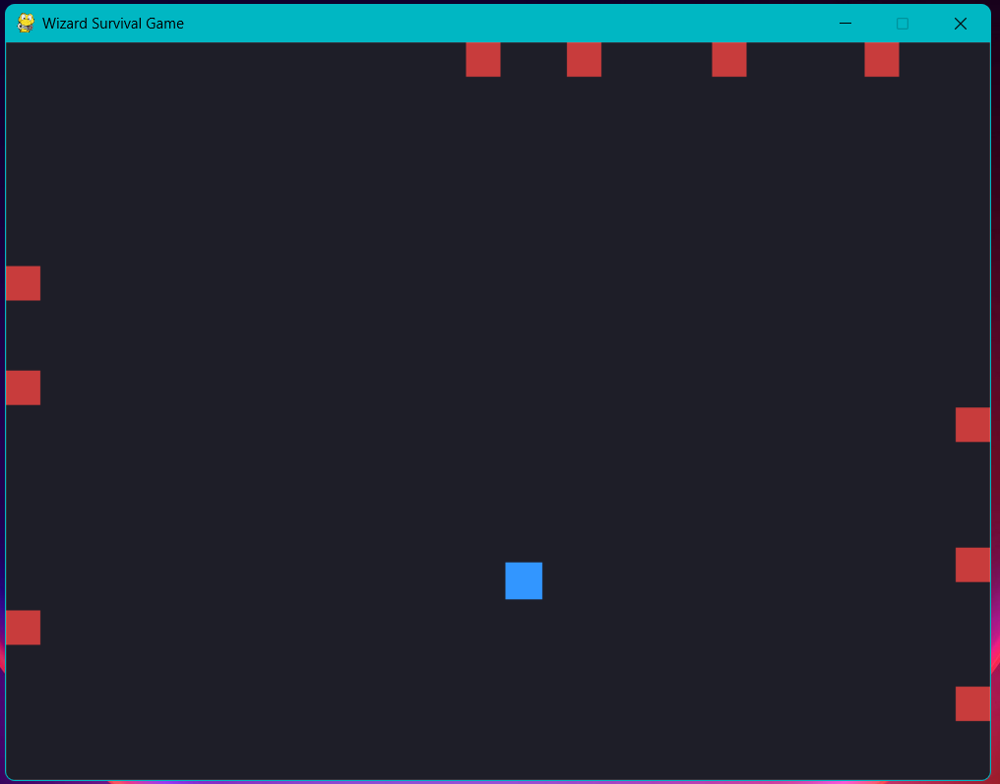

# Wizard Survival Game

Welcome to this little game I built using Python!  

This is a 2D game made with Python and pygame where the idea is simple: you’re being chased by some little square monsters, and your goal is to survive as long as possible and rack up the highest score.

Surprisingly, it’s a lot harder than you’d think. Check out the video to see a bit of gameplay!

<video controls src="gameplay_screenshots/wizard_gameplay.mp4" title="Title"></video>

This project began as a learning exercise inspired by *Python Crash Course* by Eric Matthes, and there was a lot I learned from it. I found it really interesting how complicated making a game can become and how much you have to keep track of. Overall, it was a fun challenge and gave me a real taste of how all these little systems come together into a playable experience from something I programmed.

#### The Progress of the Game.

When I started this project, I used little squares for everything since it felt like a good fit for a small mini-game. Smaller units meant I could have a lot of enemies chasing you without things getting too messy. To make the game feel more like a survival scenario, I had the monsters spawn randomly along the edges of the screen so they’d close in on you from all sides—kind of like a simple zombie survival game.

This turned into an interesting feature. When I added movement to the enemies, I learned quickly that running too close along the screen edges could get you unlucky fast. The enemy behavior—spawning randomly, calculating the shortest path to the wizard, and then moving toward you—was especially fun to build. There’s actually a surprising amount of math and vector logic behind something that looks so simple on-screen, and getting the timing and movement right taught me how much planning even a small game loop needs.

After I gave the wizard the ability to move in four directions, I realized that unlike the Alien Invasion arcade game, I needed the wizard to “face” a direction so spells would fire the way you were moving. The side effect of this is that you actually have to face enemies to attack them, which adds a nice bit of difficulty. You can’t just run and shoot—you have to think about your positioning.

#### Reflection of the game.

From this I had fun with the hands-on experience with structuring a project like this, organizing classes, and keeping the code maintainable as I added more features. I used the overall structure from the book (game loops, settings, sprites, event handling), but the monster behavior, spawning system, and other gameplay tweaks were my own ideas. 

#### Future Ideas for the project.
Things I might add later:

- Sound effects for collisions or little fireball explosions when spells hit monsters
- Different monster types with different health
- Power-ups, like a temporary shield after earning a certain number of points
- Better artwork instead of simple rectangles

But for now, I feel this small game is good for a beginner and it shows everything I set out to learn and I'm pleased with how it came out.

##### How to Run the Game
Requirements
-  Python 3.9+

 1. Install dependencies:
`pip install pygame`
  2. Run the main game file:
`python main.py`